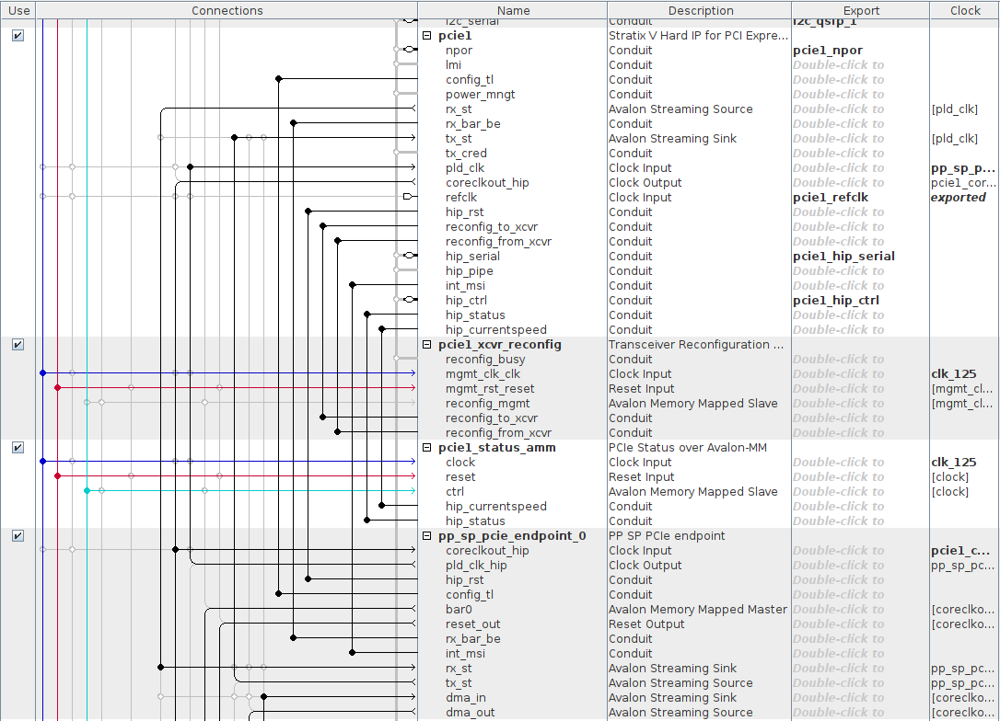
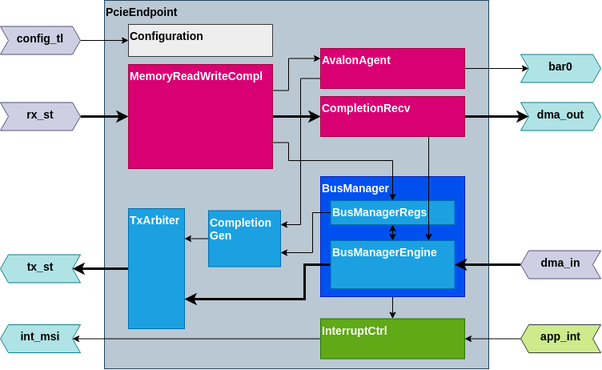

# PCIe endpoint with a high-performance DMA and an Avalon-MM interface

Designed to be used together with Stratix V Hard IP for PCI Express Intel FPGA
IP. It provides 256-bit interface, capable of operating at 250 MHz which
corresponds to Gen 3 (8 GT/s) x8 link.

## Example usage

The figure below shows the usage of this IP in Quartus Platform Manager.

## Block diagram

Illustrated in the figure below are the main modules of this IP.

## Dependencies

The tests in this Chisel HDL project require [BFM Tester for Chisel
HDL](https://github.com/j-marjanovic/chisel-bfm-tester).

---

Intel, the Intel logo, Altera, Nios, Quartus and Stratix words and logos are
trademarks of Intel  Corporation  or  its subsidiaries  in  the  U.S.  and/or
other  countries.

PCI Express® and PCIe® are registered trademarks of PCI-SIG.

All trademarks and registered trademarks are the property of their respective
owners.
