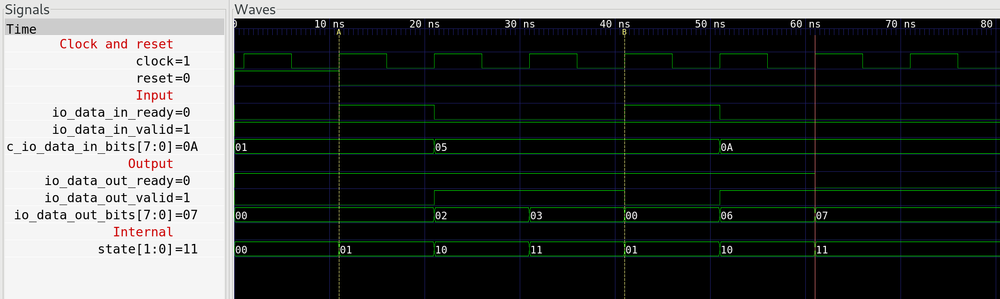

# Simple example for OrderedDecoupledHWIOTester

This example demonstrates why, in my opinion, OrderedDecoupledHWIOTester
currently is not a good utility to test slighly more complex examples.

Presented here is a module (DUT) which for every input value X generates
two values on the output, X+1 and X+2.

The test does the following:

1. Drives value 1 on the input
2. Expects to receive 2 and 3 on the output
3. Drives value 5 on the input
4. Expects to receive 6 and 7 on the output
5. Drives value 10 on the input
6. Expects to receive 11 and 12 on the output

Unfortunately, this is not what really happens, at least as of October 29th
2018 with Chisel3 version 3.1.3. and Chisel-iotesters version 1.2.5. Only
two input values are driven into the DUT, and only 3 values are received.

It is obvious that tester expect the same number of values on input as on
output. This might be OK in some examples, but might not be OK in other, e.g.
when a module appends a header or footer to the data or for decompressors.

Output log is shown below. Note also that even though the tester does not
receive all values which are expected, it still reports test as passed.

```
chisel3 version 3.1.3
Chisel.iotesters version 1.2.5
...
Enabling waves...
[OrdDecoupIo] received data: 0x01
Starting simulation!
in_event_counter  0, out_event_counter  0
output test event  0 testing data_out.bits =   2, should be  2
in_event_counter  1, out_event_counter  0
output test event  1 testing data_out.bits =   3, should be  3
in_event_counter  1, out_event_counter  1
[OrdDecoupIo] received data: 0x05
in_event_counter  1, out_event_counter  2
output test event  2 testing data_out.bits =   6, should be  6
in_event_counter  2, out_event_counter  2
in_event_counter  2, out_event_counter  3
in_event_counter  2, out_event_counter  3
in_event_counter  2, out_event_counter  3
in_event_counter  2, out_event_counter  3
in_event_counter  2, out_event_counter  3
Exceeded maximum allowed 10 ticks in OrderedDecoupledHWIOTester, If you think code is correct use:
DecoupleTester.max_tick_count = <some-higher-value>
in the OrderedDecoupledHWIOTester subclass
[info] OrdDecoupIoTest:
[info] Ord Decoup Io tester
[info] - should compare expected and obtained response
[info] ScalaTest
[info] Run completed in 4 seconds, 184 milliseconds.
[info] Total number of tests run: 1
[info] Suites: completed 1, aborted 0
[info] Tests: succeeded 1, failed 0, canceled 0, ignored 0, pending 0
[info] All tests passed.
[info] Passed: Total 1, Failed 0, Errors 0, Passed 1
[success] Total time: 9 s, completed Oct 29, 2018 8:54:38 PM

```


And this is the waveform of the test:


